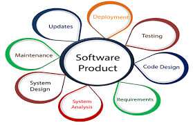

After coming back to relearning javascript, I realize that there is so much that I do not know. Back then I use to use 'var' for everything because I did not know the difference between 'let', 'const' oppose to 'var'. After finishing ES6 though, I realize var is really bad and some of the problems I encountered in High school is attributed to using var. This is probably because the teacher at the time did not think knowing the difference was very relevant to high schoolers at the time and we got the projects done just fine using var. I am however very thankful for taking that course because it helped me have a headstart in learning python, java, C, and now Javascript. This can be seen on my linkedin where I took the skill quiz and I scored in the upper 15% of all quiz takers (out of 800,000+ people). 

## Development Skills
I hope by taking ICS 314, I will be able to become more experienced with javascript and able to solve complex problems very fast for interviews (WODs). Since I already had a pretty good background in Javascript, I hope to refresh myself on the langauge and learn new applications to apply it. Some programs I hope to learn from this class is Git, intelliJ and meteor. These are completely new to me and I was already planning to self learn Git and intelliJ as I see many internships prefer these skills.

## Experiences
Some experiences I hope to gain from taking this course is being able to work in a group with othe fellow programmers. Although professors always promoted working in a group to solve their projects and homework, people never actually tried to work with others, like in ICS 111, 211, EE160 and EE260. Despite being in a group for some of these classes, we basically coded everything by ourselves. I know in the real world, working on code with many strangers will become the norm and I hope to make more of an effort this semester to help and discuss code during the WODs and after class.

## Conclusion
All in all I am excited to learn more about javascript and make myself a better intern/job candidate in the eyes of companies. Hopefully I am able to put the skills I learned in this class to use in the real world. 
