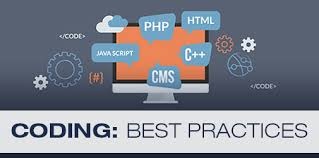

When I first started programming, I would constantly look at code from stack overflow and other open source websites and then I would look at mine. First thing I noticed was the 
strict spacing of each line and I would think to myself, 'why do people do this? Does it help? Is it required?'. In my high school web design class, syntax was not extremely important 
and I would pick up some pretty bad coding habits (such as using tabs instead of spaces, oh the horror). It went on like this even in my C programming class in engineering and python
class, as the professor never enforced coding standards. It was not until my second semester of sophomore year and taking Java, the professors finally started punishing us for 
bad coding standards, and would make us stick to there own format. This took so much time to get use to and I would get frustrated a lot from getting points taken off because I 
used <b>TABs instead of Spaces!</b>

## How it Helps
After getting use to the various coding standards from other classes, I can see how it would help programmers such as myself. Coding standards were made to help every programmer 
understand what the heck some else's code is doing. It is easier for others to understand your code if it is neatly written. And for the longest time I did not understand this
and just thought that other programmers are doing something that I don't know yet. Before learning about coding standards, I would look up code on stack overflow and I would not
understand what some answers were talking about because it is so much more different than my own code. It also helps that when you ask a question and you show someone your code, they
would easily be able to follow and understand what they are looking at. Collaboration is paramount in computer science, but in order to collaborate, you must be able to understand 
each other.

## My Thoughts
Looking at eslint, I think it is a lot more strict that any other coding standards that I had in my other classes. I am not sure if it is because of javascript, but I find it annoying
that it would give you an error for not using dot notation over bracket notations for objects, or when you finish writing your code but you need an extra space at the end or else you
get an error. Overall it is very nitpicky and I don't like it (yet).

## In the End
Overall, coding standards is integral in computer science because it is like the programmers grammar and if someone is speaking to you in poor grammar, it would be hard to follow 
the conversation. Same can be said about our code.
