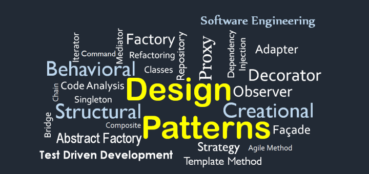

After developing multiple applications and applying extensive materials, I have learnt that there are many problems that reoccurs throughout the development process. In order to
solve these problems, I have learnt design patterns. To me, design patterns are generally a set of steps that are created to solve problems that developers encounter throughout
the development process. Since the same problems will keep occurring, then it only makes sense that the same solutions will be able to solve them. Thats what makes design patterns
so great! Some common design patterns that I have used (although unknowingly) is the factory design pattern, singletons, model-view-controller and observer. Another design 
pattern that I never knew was constantly applied what prototyping. Prototyping is applied whenever I used javascript because do not use class instantiation and instead uses 
instances to create methods. 

## Applications of Design Patterns
Now that you know what some commonly used design patterns are called, here is how I applied them to some of my projects. Starting off with the simple design pattern, prototyping,
everytime I used javascript to create methods/functions for my applications, I have applied the use of prototyping! Then for singletons, when I used meteor frameworks, we 
create things called collections. Collections are the built in databases used by meteor to develop the back-end portion of your projects. Collections used by setting to a 
'collection' or 'singleton' that we use to store the users data. Kind of like a filing cabinet storing a bunch of folders and documents. Another design pattern that is commonly
used are observers. Observers to me are kind of like event handlers. I usually apply these to parallel algorithms so that I can change data or dependencies during run time or 
have many open ended dependencies. I don't often use observers because it can easily lead to race conditions and leading to long runtimes. Another reason why I don't use it often
is because it is difficult to debug. Another design pattern that we use is the factory method. I have used the factory method to create functions that returns multiple different 
types of objects. For example, there is a shape method where if calld it returns a shape object. The shape object can return a circle, rectangle or triangle. This we can see 
how the factory method is useful. It creates objects on our behalf without actually specifying the class. The next design pattern is one that I use the most, the model-view-controller
method. In developing web applications, it is split between 2 categories, the front-end and the back-end. The model-view-controller method tries to seperate the system model
from the user. Meaning users will be able to see the front-end of the applications such as visuals and UI's, while hiding the back-end portion such as the databases and collections.

## Bad Design Patterns
Now that we know some design patterns used to fix commonly occurring problems, we ask ourselves, what are bad design patterns? Inherently bad design patterns could fix some of these
problems, but consequently is could lead to more problems later. One bad design pattern I have learnt is the lavaflow pattern. It is when a application has dead or forgotten
code that is frozen in new implementations. An example of this is when a application is first created, then the people who created this application is replaced and down the line
of replacements, the people start to forget what some blocks of code in the application does. This leads to them not wanting to change it because it could break the whole 
application, leading to the 'freeze' in implementations to the application.

## Wrap Up
Although these design patterns are used to fix reoccurring problems, it is not without consequences. Singletons utilizes global states which in design, are not a good thing to use. 
Observers allow the users to run multiple things and even change data at runtime, but doing so significantly slows the application and creates race conditions. 
Factory method can return multiple objects and helps build/create other objects, it is a lot more complicated than class constructors. For model-view-controller seperates 
the users experience from the work done by the developers creating better applications, but it comes with a large learning curve and is complex in general. 
All in all, design patterns are a useful tools for software developers/engineers to fix problems in their applications. 
