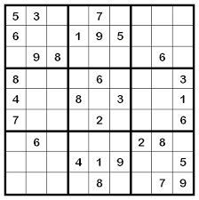

This is a hexadecimal sudoku solver that I first made in ICS-211 for a project and later improved it further. It takes in 16 x 16 sudoku puzzles and breaks it up into 4 x 4 puzzles, which is then solved using brute force with recursion. This was by far one of the most difficult projects I had to make in my ICS-211 class, and also my most proudest achievement in that class.

What differs from this hexadecimal sudoku solver from my original one is that this solves the puzzle a lot faster. My old sudoku solver utilized a type of brute force method to solve difficult puzzles whith took around 10 minutes with my computer to solve. This is very inefficient and so I tried to improve it. This new sudoku solver takes about 2 to 5 minutes to solve a difficult 16 x 16 sudoku puzzle as opposed to 10+ minutes.

This project helped me understand recursive functions better and how to apply recursion to complex problems I encounter in the future.
 
Source: <a href="https://github.com/tonylong1314520/sudoku-solver"><i class="large github icon"></i>tony/sudoku-solver</a>
