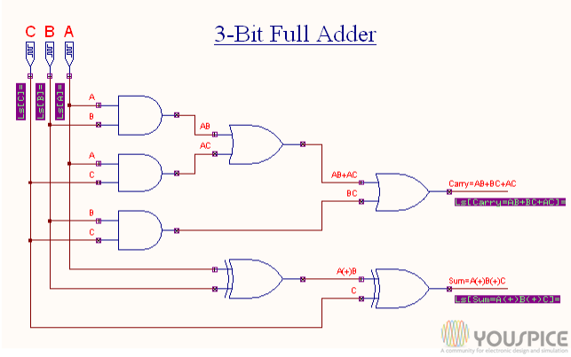
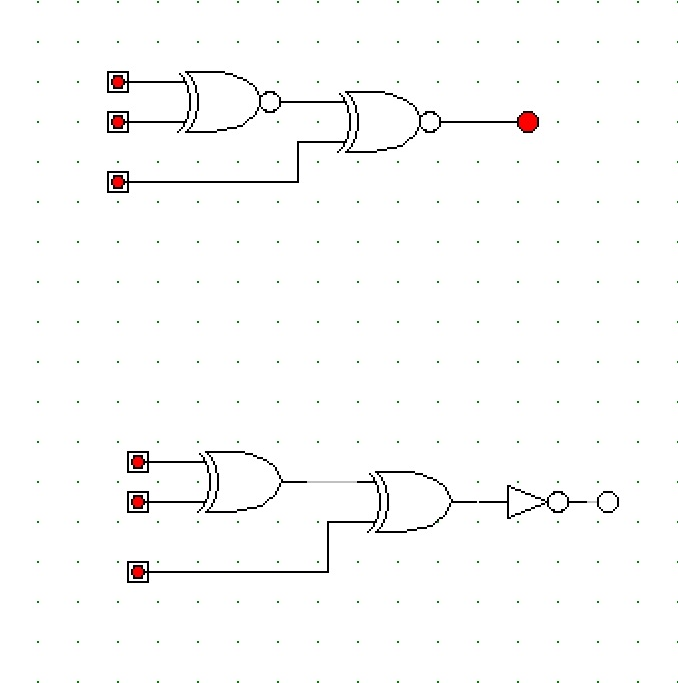

An arithmetic logic unit (ALU) is a combinational digital circuit that performs arithmetic and bitwise operations on integer binary numbers.
My ALU takes in two 3-bit inputs in binary and performs different calculations based on what switches you set it to. Some operations it
can perform are adding with a carry, multiply input by 2, and xor operations.

Here are some illustrations on the functions.

  
  

Check it out here! -->
Source: <a href="https://github.com/tonylong1314520/Simple-ALU-project"><i class="large github icon "></i>tony/arithmetic-logic-unit</a>

