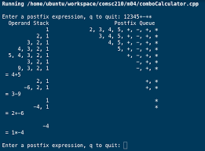

This was a project I decided to do during my free time to try and understand how postfix and prefix notations worked in computer science. I implements this by using a Stack to 
utilize my knowledge of Java to learn this. I find it easier to learn computer science things by coding it out. 

Doing this project also helped me understand how recursions work on runtime. I learnt that recursive functions utilize the IDE on runtime and creates a runtime stack which keeps
stacking the called method until a base case has been met, then it will 'pop' outputs from the top to bottom until the all the calls have been returned. This helped me better
understand and implemented my next project.(sudoku solver) 

Source: <a href="https://github.com/tonylong1314520/Post-Prefix-Calculator"><i class="large github icon"></i>tony/post-prefix-calculator</a>
