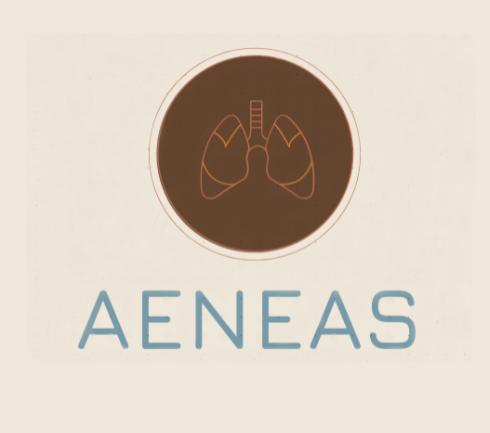

Me and my group members were tasked to create a web application to help Hawaii's H.O.M.E Project, a nonprofit that aims to help improve quality and access to healthcare for our 
local community. The web application was created to help H.O.M.E manage their supplies, keep track of where different medications are kept, and what was distributed to patients.

You an check out Hawaii's H.O.M.E project here!-->
Source: <a href="https://sites.google.com/view/hawaiihomeproject/about?authuser=0">H.O.M.E<i class="large github icon"></i></a> 

Check out a brief intro to the web application here! -->
Source: <a href="https://runtime-terrorz.github.io/"><i class="large github icon">Info</i></a>

Check out our web application here! -->
Source: <a href="https://github.com/Runtime-Terrorz/HOME-Project-v2">AENAS<i class="large github icon"></i></a>
